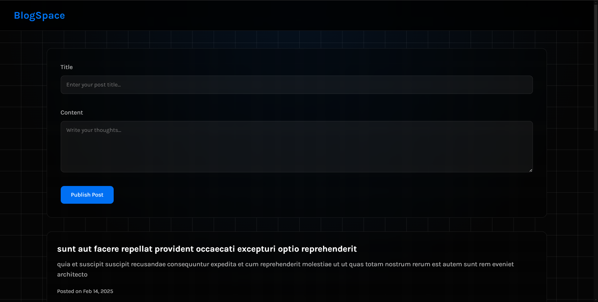
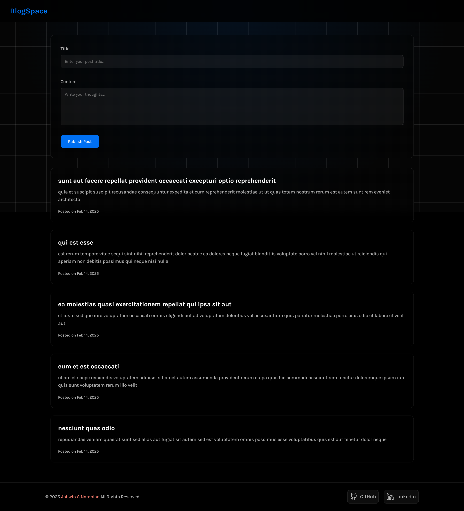
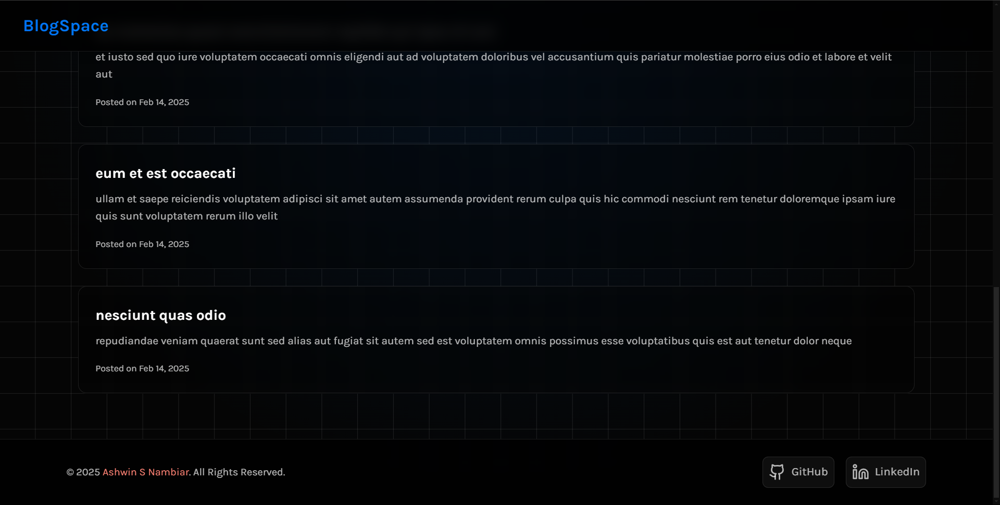
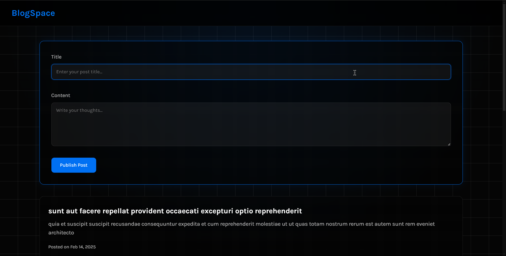
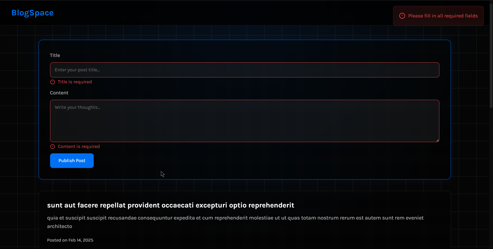
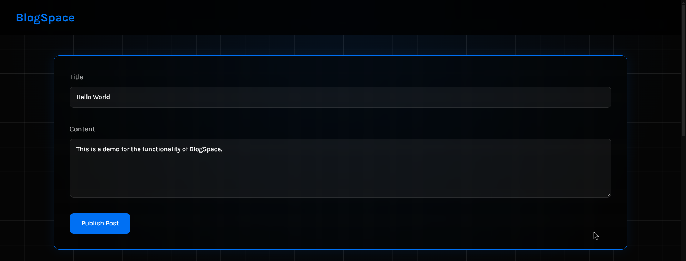
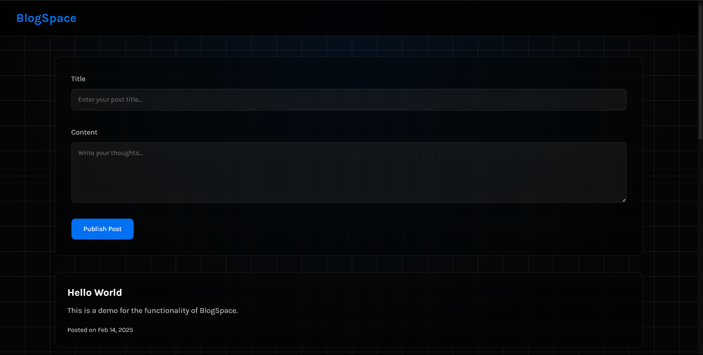

# BlogSpace 🖥️

<div align="center">


A website to display and write blogs.

[Features](#-features) • [Tech Stack](#-tech-stack) • [Installation](#-installation) • [Contributing](#-contributing) • [Screenshots](#-screenshots) • [Live](#-live) • [Author](#-author)

</div>

## ✨ Features

- **Blog Display:** Showcases blogs in a user-friendly format.
- **Blog Writing:**  Provides a platform for users to create and publish their own blogs.

## 🛠 Tech Stack

- **HTML 5:**  For structuring the content and layout.
- **CSS 3:** For styling and visual presentation.
- **JavaScript:** For interactivity and dynamic functionality.

## 🚀 Installation

1. **Clone the Repository:**

      ```bash
      git clone https://github.com/Ashwin-S-Nambiar/Blogspace.git
      
      cd password-generator
      ```

2.  **Open the Project:**

      **Simply open the `index.html` file in your web browser.  No further setup is required.**

## 🤝 Contributing

Contributions are welcome! Here's how you can help improve BlogSpace:

1.  **Fork the repository**

2.  **Create a feature branch:**
      ```bash
      git checkout -b feature/your-feature-name
      ```

3.  **Make your changes and commit them:**
      ```bash
      git commit -m 'Add some feature'
      ```

4.  **Push to the branch:**

      ```bash
      git push origin feature/your-feature-name
      ```

5.  **Open a Pull Request**

## 📸 Screenshots

<div align="center">

### **Landing Page**


### **Full Interface**


### **Footer**


### **Publish Post**


### **Post Validation**


### **Writing a Post**


### **New Post Added**


</div>

## 🌍 Live

<div align="center">

[](https://blogspace-chi.vercel.app/)

</div>

## 👤 Author

### Ashwin S Nambiar
- Portfolio: [ashwin-s-nambiar.is-a.dev](https://ashwin-s-nambiar.is-a.dev/)
- GitHub: [@Ashwin-S-Nambiar](https://github.com/Ashwin-S-Nambiar)

---

<div align="center">
Made with ❤️ by Ashwin S Nambiar
</div>