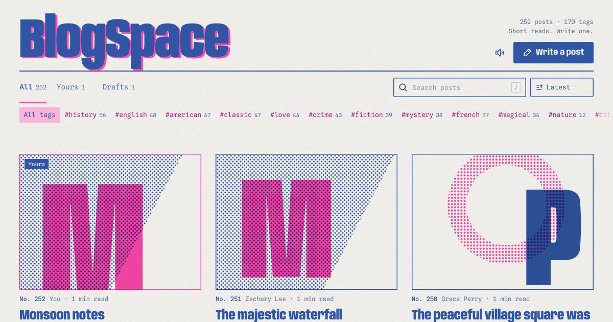
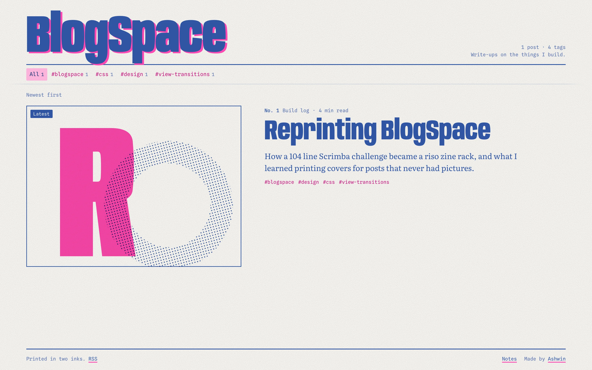
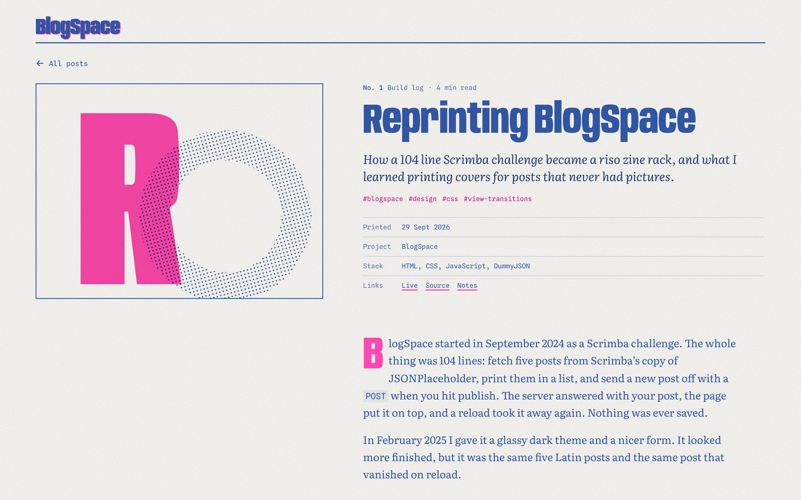
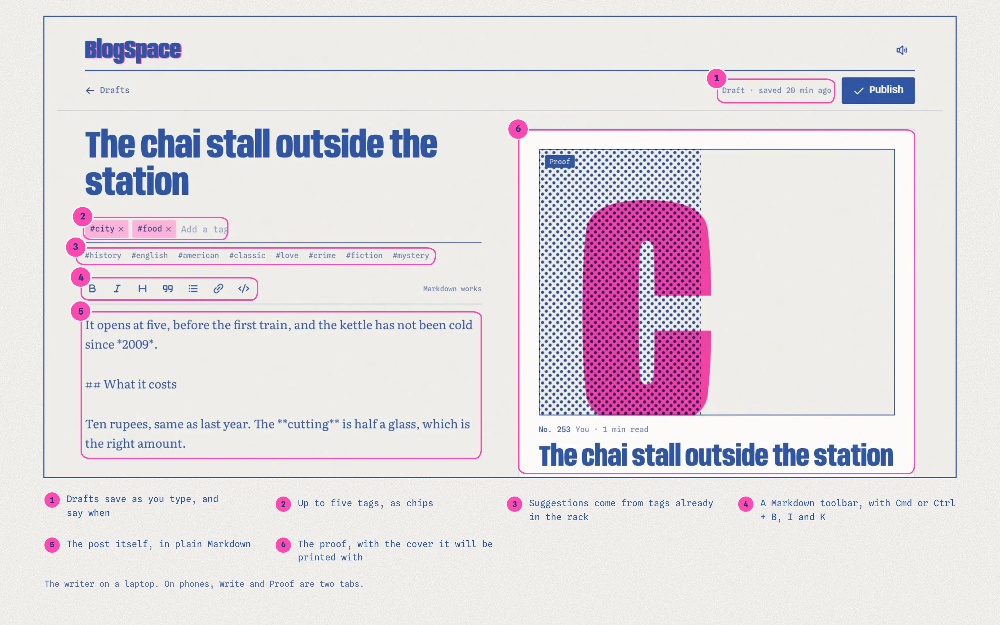
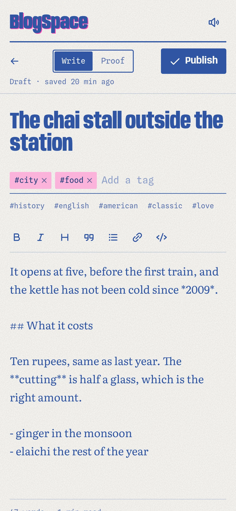
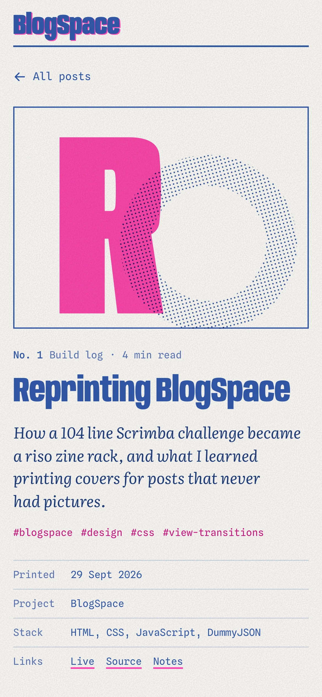
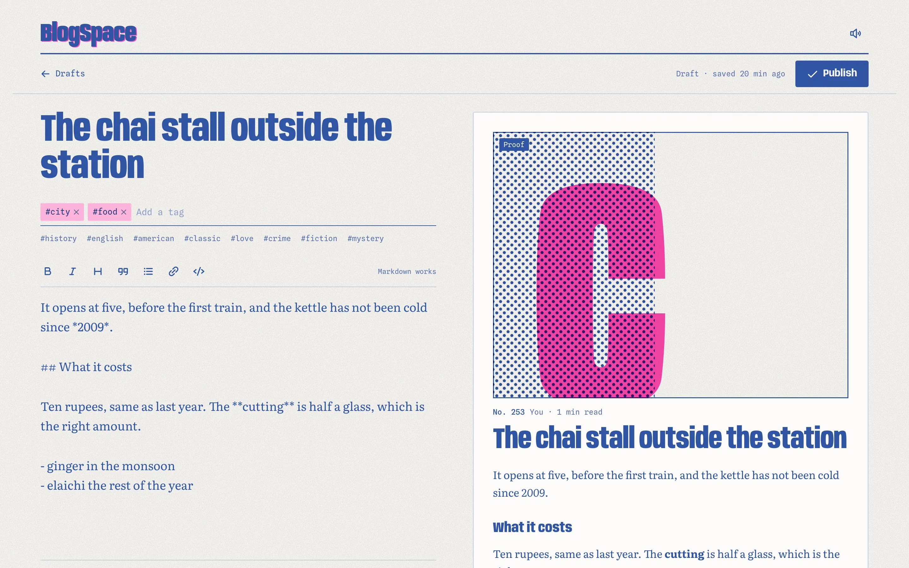
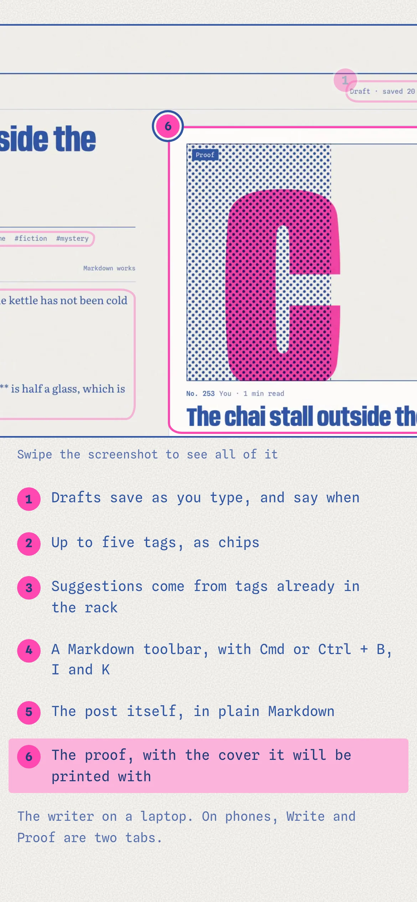
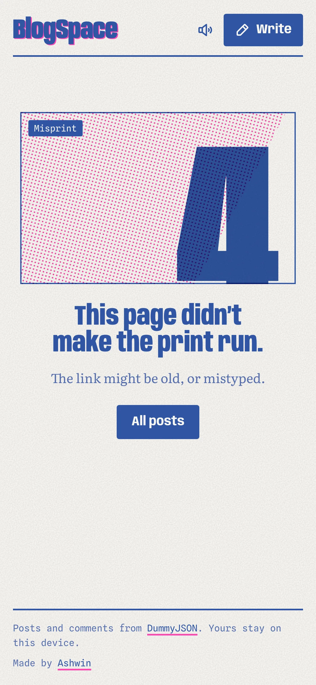

<p align="center">
  <a href="https://blogspace.ashwin.co.in">
    
  </a>
</p>

<p align="center">
  <a href="https://blogspace.ashwin.co.in"><strong>blogspace.ashwin.co.in</strong></a>
  &nbsp;·&nbsp;
  <a href="#what-it-does">what it does</a>
  &nbsp;·&nbsp;
  <a href="#the-design">the design</a>
  &nbsp;·&nbsp;
  <a href="#running-it">running it</a>
</p>

<br>

<p align="center">
  
</p>

the source of **[blogspace.ashwin.co.in](https://blogspace.ashwin.co.in)**, a rack of short reads and a place to write your own. it is printed like a risograph zine: two inks, blue and fluorescent pink, on plain stock, and every post gets its own halftone cover.

the posts, authors and comments come from [dummyjson](https://dummyjson.com/docs/posts). what you write is kept on your device and never sent anywhere.

it used to be a form that posted to a fake endpoint and forgot the post on reload, over a feed of latin placeholder text. now it reads 251 real posts and keeps yours.

it is one html file, one stylesheet and a few small modules. no framework and no build step.

## what it does

<p align="center">
  
  &nbsp;
  
  &nbsp;
  
</p>

- **a rack to browse.** every post as a cover, a number, the author, a read time, the title, an excerpt, its tags and its likes. more load as you scroll.
- **tags, search and sort.** a row of every tag with its count, a search that looks through titles, text, tags and authors as you type, and latest, most liked or most read.
- **read it properly.** each post has its own page and link, set large with a drop cap, with the author, views, word count, the comments from dummyjson, and the next and previous posts.
- **like and comment.** likes and your comments stay on your device, and your comments can be deleted with undo.
- **write your own.** a title, up to five tags (with suggestions from the tags already in use), and the post in markdown, with a toolbar and `cmd` or `ctrl` + `b`, `i` and `k`. the proof beside it shows the post as it will print, cover and all. on a phone, write and proof are two tabs.
- **drafts save as you type.** close the tab halfway and it is under drafts when you come back. editing a published post keeps a draft of the edit until you update it.
- **the print run.** publishing lays the pink pass on your new cover, then the blue one, and lands it with a thump.
- **yours stays yours.** your posts are numbered after the last one in the feed, marked yours, and listed under their own tab. edit or delete them any time, with undo.
- **markdown in and out.** save any post as a `.md` file, export all of yours in one file, and import `.md` files back (one post per file, or several with front matter).
- **keyboard.** `n` to write, `/` to search, `j` and `k` for next and previous, `l` to like, `s` to share, `e` to edit, `esc` to go back. `?` lists them.
- **share.** the share sheet on phones, a copied link everywhere else.
- **sounds.** a drum pass for each ink and a thump when a post lands, a pop for likes and a tick for taps, made with the web audio api. they wait for your first tap, stay quiet under the ios silent switch, and mute in one tap.
- **works offline.** the feed is kept on the device and refreshed in the background, and a small service worker keeps the app itself, so the rack and your posts open with no connection.
- **a misprinted 404**, and every page sets its own title.

## the design

a blog is self publishing, and the cheapest, loudest way to self publish on paper is a riso zine. so that is what it looks like.

- **two inks.** medium blue (`#2f55a4`) for all the text and fluorescent pink (`#ff48b0`) for the loud parts, on a natural stock (`#f7f6f2`) with a fibre grain. deeper cuts of each are used where text needs the contrast. there is no dark mode: it is printed paper.
- **generated covers.** every cover is built from its post: the first letter of the title (skipping the and a) in one ink, a shape in the other, solid, halftone or ruled. the pink pass sits a couple of pixels off register, like a real riso print. the same post always gets the same cover.
- **the wordmark.** blue over pink, printed off register.
- **type.** [anybody](https://fonts.google.com/specimen/Anybody) for the wordmark, titles and covers, squeezed down its width axis like a poster face. [literata](https://fonts.google.com/specimen/Literata) for reading, and [spline sans mono](https://fonts.google.com/specimen/Spline+Sans+Mono) for numbers, tags and labels.
- **moving between pages.** the cover you tap grows into the post, and shrinks back into its place in the rack when you go back, using view transitions. the wordmark folds down to a small header on inner pages.
- **every screen.** one column on phones, two on tablets, three or four on desktop, and the post page puts the cover beside the text when there is room. it was checked at 15 sizes from a 320 px iphone se to a 2560 px monitor, including landscape phones, with no sideways scroll and nothing clipped.
- **nothing jumps.** fonts are self-hosted and preloaded with metric matched fallbacks, the page fades in once they are ready, and loading placeholders hold the same space as what replaces them. layout shift on load measures 0.

<details>
<summary><strong>more screenshots</strong></summary>

<br>





<p align="center">
  
  &nbsp;
  
</p>

</details>

## the stack

| layer | choices |
| --- | --- |
| markup and style | plain html and css |
| script | es modules in [`js/`](js), loaded straight by the browser |
| data | [dummyjson](https://dummyjson.com/docs/posts) posts, users and comments; your posts, drafts, likes and comments in `localStorage` |
| motion | css, the web animations api and view transitions |
| type | [anybody](https://fonts.google.com/specimen/Anybody), [literata](https://fonts.google.com/specimen/Literata) and [spline sans mono](https://fonts.google.com/specimen/Spline+Sans+Mono), self-hosted |
| icons | [phosphor](https://phosphoricons.com) bold, inlined as an svg sprite |
| hosting | [vercel](https://vercel.com/), as static files |

## running it

there is nothing to install. the modules need to be served rather than opened as a file, so any static server works:

```sh
git clone https://github.com/Ashwin-S-Nambiar/Blogspace.git
cd Blogspace
python3 -m http.server 5173   # or: npx serve
```

then open http://localhost:5173.

## the shape of it

```
index.html      the page, the halftone patterns and the icon sprite
index.css       tokens, then every component, in one file
404.html        the misprint page
sw.js           keeps the app on the device for offline use
js/
  main.js       routes, the rack, the post page, the writer, toasts and keys
  api.js        dummyjson: the feed, authors and comments, cached on the device
  cover.js      the two ink covers, generated from each post
  md.js         a small, safe markdown renderer
  store.js      your posts, drafts, likes and comments
  sound.js      web audio drum, thump and pop
  tip.js        tooltips for icon buttons
fonts/          anybody, literata and spline sans mono, latin and latin-ext
```

## known rough edges

- **your posts live on one device.** there is no account and no sync. export them as markdown to move them.
- **dummyjson is read only.** likes and comments on its posts are kept on your device too, and nobody else sees them.
- **clearing site data clears your posts.** the export button is the backup.

---

[blogspace.ashwin.co.in](https://blogspace.ashwin.co.in) · [ashwin.co.in](https://ashwin.co.in) · [notes](https://notes.ashwin.co.in) · [x](https://x.com/ashwinnambiar11) · [github](https://github.com/Ashwin-S-Nambiar)
