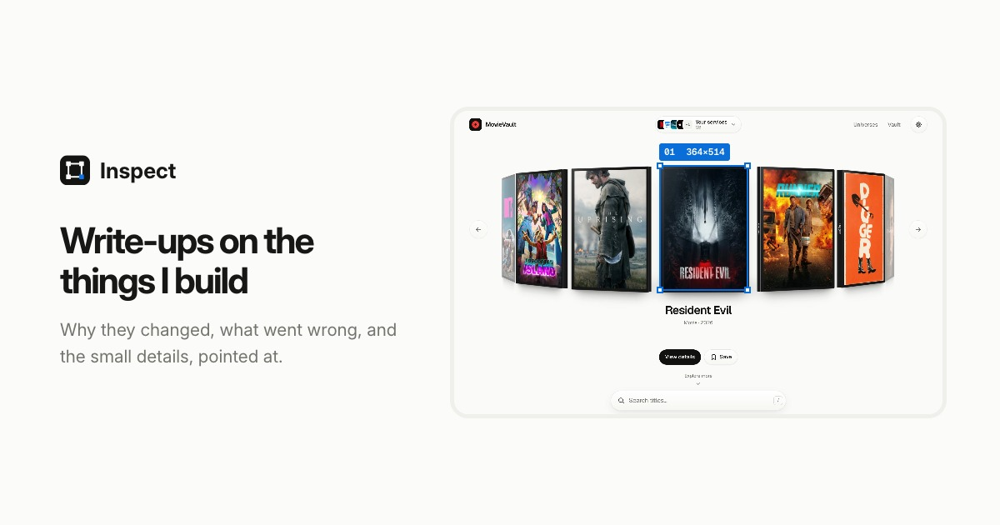
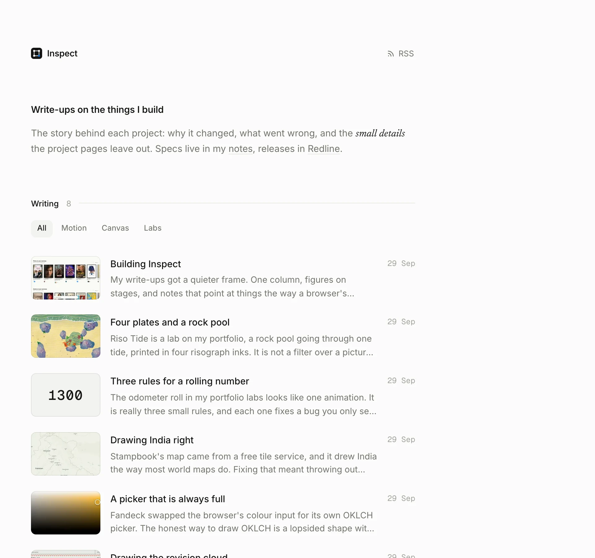
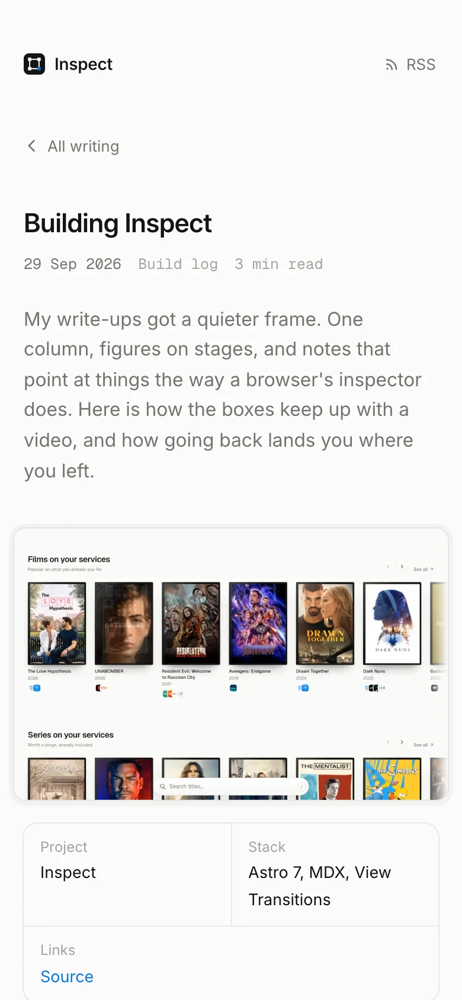
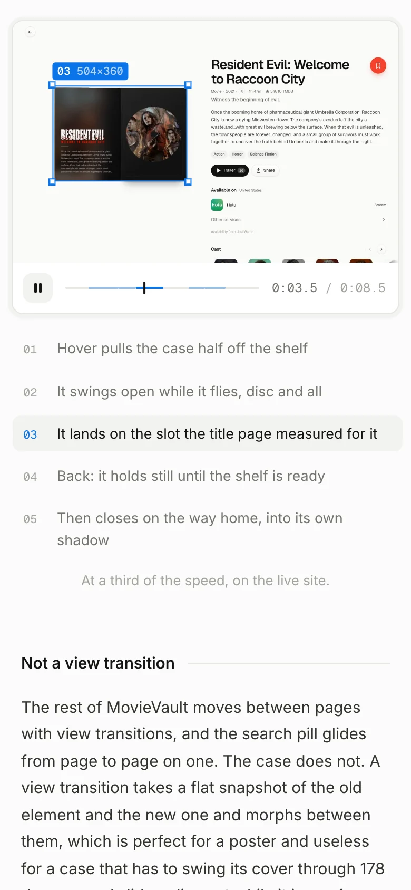
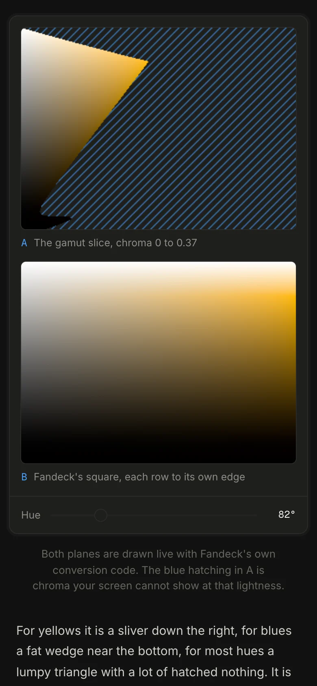
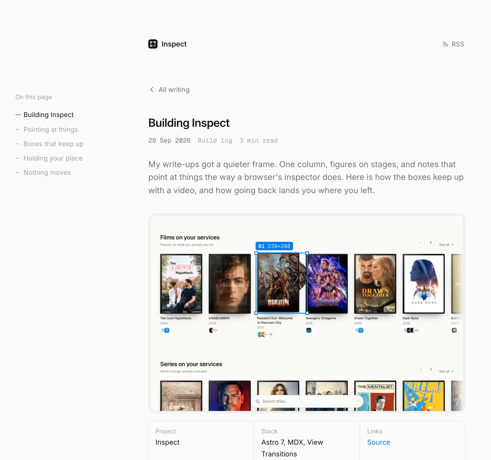
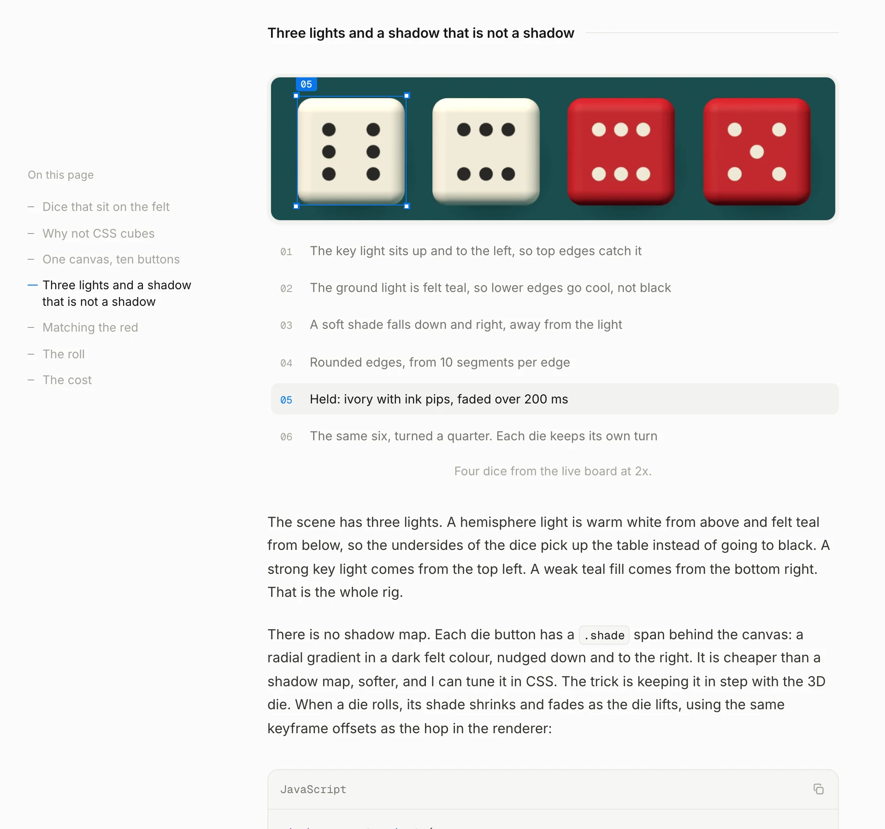
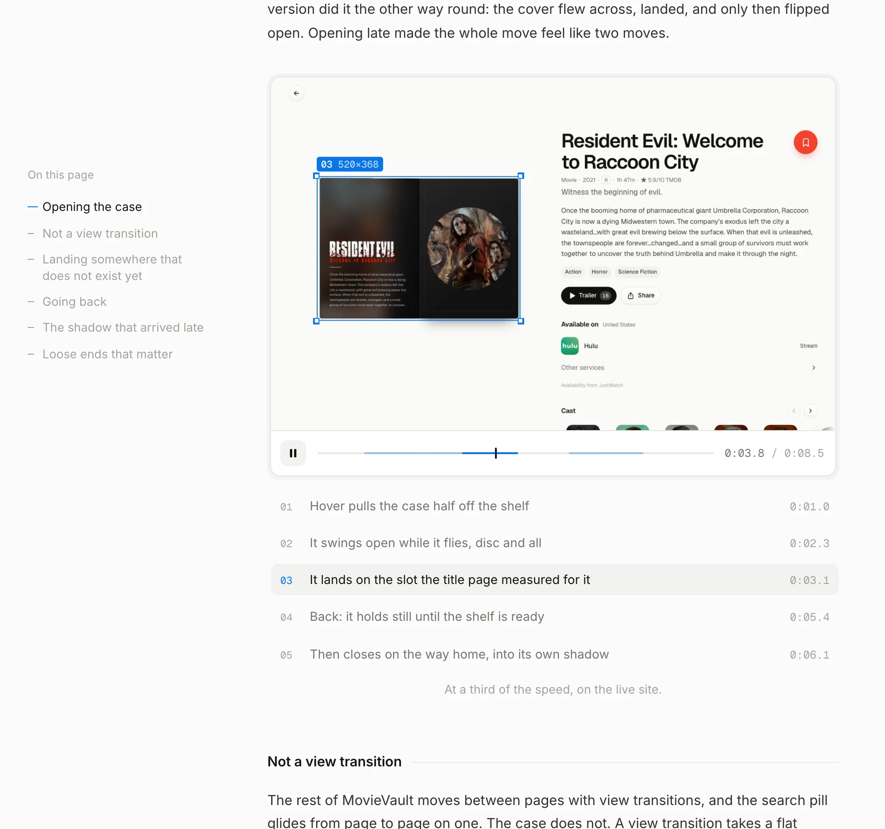

<p align="center">
  <a href="https://inspect.ashwin.co.in">
    
  </a>
</p>

<p align="center">
  <a href="https://inspect.ashwin.co.in"><strong>inspect.ashwin.co.in</strong></a>
  &nbsp;·&nbsp;
  <a href="#what-it-is">what it is</a>
  &nbsp;·&nbsp;
  <a href="#writing-a-post">writing a post</a>
  &nbsp;·&nbsp;
  <a href="#running-it">running it</a>
</p>

<br>

<p align="center">
  
</p>

the source of **inspect**, write-ups on the things i build. one column, figures on stages, and notes that point at things the way a browser's inspector does: a blue box with handles, and its size.

## what it is

each post is the story of a project: why it changed, what went wrong, and the details the project pages leave out. the specs live in [my notes](https://notes.ashwin.co.in) and the release history in [redline](https://redline.ashwin.co.in). this is the story part.

<p align="center">
  
  &nbsp;
  
  &nbsp;
  
</p>

- **notes that point.** screenshots stay clean until you point at a part of them, or at a note, and that part gets a selection box or a numbered badge. on a phone you tap a note and it stays.
- **boxes that keep up.** clips have a timeline with the noted stretches marked. the box follows what it points at, frame by frame, synced to the frame on screen with `requestVideoFrameCallback`.
- **live demos.** some figures are the real thing, ported to run on the page: an odometer, oklch planes, a revision cloud and a riso press.
- **before and after.** drag across two screenshots to compare them.
- **a hero on every post.** a loop or a still on the same 16:10 stage, with the poster set to the clip's first frame.
- **code cards.** each block gets its language and a copy button, built into the html.
- **a feed.** every post goes out on [rss](https://inspect.ashwin.co.in/rss.xml), and there is a sitemap.

## the design

- **quiet on purpose.** a near white page (`#fbfbfa`), grey text, and one blue (`#0a74e8`) for everything that points. dark mode follows your system, with no switch.
- **type.** [inter](https://rsms.me/inter/) for everything, [newsreader](https://fonts.google.com/specimen/Newsreader) italic for the odd word in *italics*, and [geist mono](https://vercel.com/font) for dates, times and sizes.
- **one column.** 620 px of text with figures the same width, and the contents in the left margin on wide screens.
- **moving between pages.** only the title moves: it glides from its row into the post and back, with cross document view transitions. there is no client router.
- **your place is kept.** going back restores the list's scroll before the first frame, so the title lands on its own row.
- **nothing jumps.** fonts are self-hosted and preloaded with metric matched fallbacks, heroes and figures have their size before they load, and the page fades in once the fonts are ready. layout shift measures 0 on load and while you use the figures, on 11 sizes from a 320 px phone to a 2560 px monitor, light and dark.

<details>
<summary><strong>more screenshots</strong></summary>

<br>







</details>

## writing a post

a post is a folder in [`src/content/posts`](src/content/posts) with an `index.mdx` and its media beside it:

```
src/content/posts/building-inspect/
  index.mdx
  hero.mp4
  hero.jpg
  post.png
```

the front matter:

```yaml
---
title: Building Inspect
dek: One line under the title, also used for feeds and link previews.
date: 2026-09-29
kind: build log            # build log, deep dive or note
tags: [inspect, design]
draft: false               # drafts show in dev only
project:
  name: Inspect
  live: https://inspect.ashwin.co.in
  repo: https://github.com/Ashwin-S-Nambiar/Blogspace
  notes: https://notes.ashwin.co.in/projects/Inspect
  stack: [Astro 7, MDX]
hero:
  image: ./hero.jpg        # the still, or the clip's first frame
  video: ./hero.mp4        # optional, a short muted loop
  alt: what the hero shows
  fit: cover               # or contain, with bg: '#hex' behind it
thumb: ./thumb.png         # optional, the list thumbnail if not the hero
---
```

then import what the post needs from `src/components`. positions are percentages of the image or frame, from the top left.

```mdx
<Annotated
  src={shot}
  alt="what the screenshot shows"
  marks={[{ x: 4, y: 43, w: 16, h: 5, note: 'A box around this part' }]}
/>

<Clip
  src={clip}
  poster={clipPoster}
  length={8.5}
  track={track}
  label="what happens in the clip"
  cues={[{ from: 1, to: 2.3, text: 'Follows the tracked path' }]}
/>

<Compare before={old} after={now} beforeLabel="Before" afterLabel="After" beforeAlt="..." afterAlt="..." />

<Aside label="A note">It sits in a grey card between paragraphs.</Aside>
```

clips are h.264 mp4 without sound. a mark or cue without `w` and `h` is a numbered badge. a cue without a position follows `track`, a list of `[time, [x, y, w, h]]` keyframes. figures are full width unless you pass `narrow`.

site settings live in [`src/site.ts`](src/site.ts): the name, the tag filters on the home page, and `thumbs`, which turns the list thumbnails on or off.

## the stack

| layer | choices |
| --- | --- |
| site | [astro 7](https://astro.build) with [mdx](https://mdxjs.com), fully static |
| content | content collections, one folder per post, typed front matter |
| images | `astro:assets`, as avif and webp at three widths |
| fonts | the astro fonts api, self-hosted, with generated fallbacks |
| motion | css, the web animations api, cross document view transitions |
| feeds | [@astrojs/rss](https://docs.astro.build/en/recipes/rss/) and [@astrojs/sitemap](https://docs.astro.build/en/guides/integrations-guide/sitemap/) |
| lint and format | [biome](https://biomejs.dev), with a pre-commit hook |
| hosting | [vercel](https://vercel.com/), as static files |

## running it

```sh
git clone https://github.com/Ashwin-S-Nambiar/Blogspace.git
cd Blogspace
npm install
npm run dev       # http://localhost:4321
npm run build     # static site in dist/
npm run check     # biome and astro check
```

## the shape of it

```
src/
  site.ts             the name, filters and the thumbnails switch
  content.config.ts   the posts collection and its front matter
  content/posts/      one folder per post, media beside it
  pages/              the list, posts, tags, rss and the 404
  layouts/Base.astro  the head, header, footer and scroll keeping
  components/         annotated, clip, compare, aside, hero, code card, post list
  components/demos/   the live figures
  lib/                post helpers and tooltips
  styles/             tokens, figures and the post column
  assets/fonts/       inter, newsreader italic and geist mono
public/sw.js          retires the old app's service worker
```

---

[inspect.ashwin.co.in](https://inspect.ashwin.co.in) · [ashwin.co.in](https://ashwin.co.in) · [notes](https://notes.ashwin.co.in) · [x](https://x.com/ashwinnambiar11) · [github](https://github.com/Ashwin-S-Nambiar)
